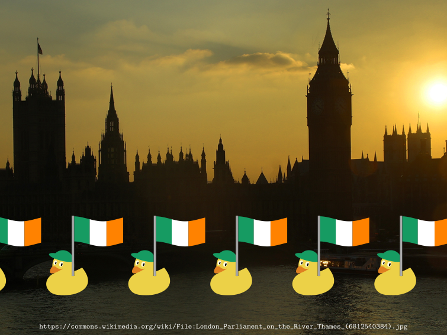
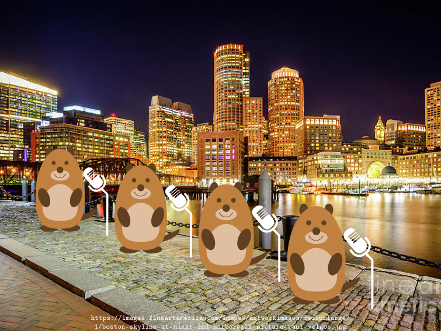
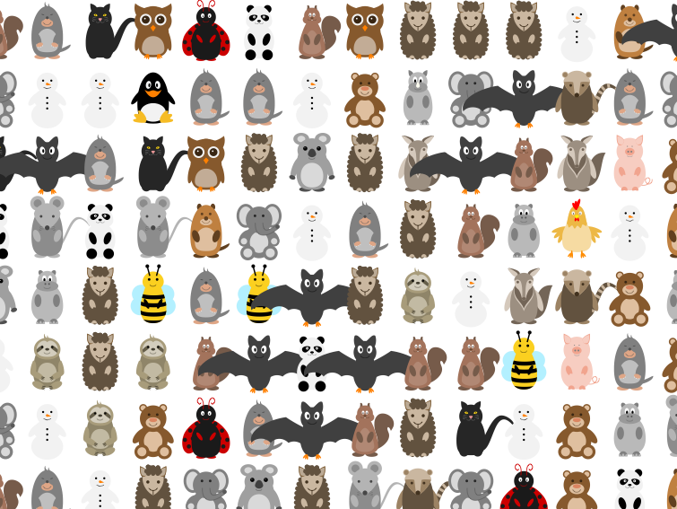

# The Great TikZlings Christmas Extravaganza 2021

This repository contains the souce code of the Great TikZlings Extravanganza 2021, created by ...

The full video is available from ...

## North Pole

- Topic: Gift wrapping at the North Pole

- Music: https://www.youtube.com/watch?v=tyTOCC_88jw (Santa's First Rush (Cinematic Christmas Adventure) by soundbay)

- Source Code: [./samcarter/NorthPole/](https://github.com/samcarter/Extravaganza2021/tree/master/samcarter/NorthPole)

## Almost silent night

- Topic: Bats gliding through the night

- Music: https://youtu.be/Yy2uHAS-el0 Bach: Air / Koopman · Berliner Philharmoniker, 9 - 045

- Source Code: [./carlatex/almostsilentnight/](https://github.com/samcarter/Extravaganza2021/tree/master/carlatex/almostsilentnight)

## A long way from home

- Topic: Irish ducks swiming down the Thames

- Music: "It's A Long Way To Tipperary"; 0:27 - 100 https://youtu.be/ztwNogPha6I

- Source Code: [./ulrike/tipperary/](https://github.com/samcarter/Extravaganza2021/tree/master/ulrike/tipperary)

## Brazilian Friend

- Topic: Sloth hanging over a water fall

- Music: Simon & Garfunkel - Bridge Over Troubled Water (Audio) - 2:09 -2:49 https://youtu.be/4G-YQA_bsOU

- Source Code: [./samcarter/BrazilianFriend/](https://github.com/samcarter/Extravaganza2021/tree/master/samcarter/BrazilianFriend)

## Silent night

- Topic: Celloplaying ducks

- Music: https://www.youtube.com/watch?v=uIqbE0Ylh9o

- Source Code: [./ulrike/cello/](https://github.com/samcarter/Extravaganza2021/tree/master/ulrike/cello)

## Valkyrie

- Topic: Valkyrie

- Music: Ride of the Valkyries

- Source Code: [./ulrike/wagner/](https://github.com/samcarter/Extravaganza2021/tree/master/ulrike/wagner)

## Boston

- Topic: Boston Skyline

- Music: Bee Gees - Massachusetts (1967) 00:49 - 1:05 - 1:20 https://youtu.be/Qk7_F1TNEFg

- Source Code: [./ulrike/boston/](https://github.com/samcarter/Extravaganza2021/tree/master/ulrike/boston)

## Mice

- Topic: Singing Mice

- Music: We wish you a Merry Christmas

- Source Code: [./samcarter/mouse/](https://github.com/samcarter/Extravaganza2021/tree/master/samcarter/mouse)

## Finale

- Topic: Grand finale

- Music: ABBA - Happy New Year (Video) - Bing Video 0:47 1:10 https://youtu.be/3Uo0JAUWijM

- Source Code: [./carlatex/finale/](https://github.com/samcarter/Extravaganza2021/tree/master/carlatex/finale)
