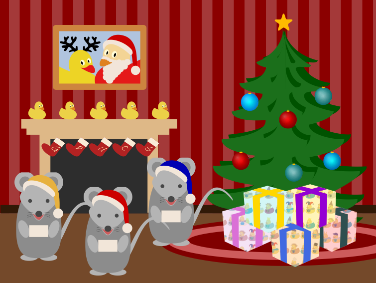

# The Great TikZlings Christmas Extravaganza 2021

This repository contains the souce code of the Great TikZlings Extravanganza 2021, created by ...

The full video is available from ...

## North Pole

- Topic: Gift wrapping at the North Pole

- Music: https://www.youtube.com/watch?v=tyTOCC_88jw (Santa's First Rush (Cinematic Christmas Adventure) by soundbay)

- Source Code: [./samcarter/NorthPole/](https://github.com/samcarter/Extravaganza2021/tree/master/samcarter/NorthPole)

## Almost silent night

- Topic: Bats gliding through the night

- Music: https://youtu.be/Yy2uHAS-el0 Bach: Air / Koopman · Berliner Philharmoniker, 9 - 045

- Source Code: [./carlatex/almostsilentnight/](https://github.com/samcarter/Extravaganza2021/tree/master/carlatex/almostsilentnight)

## Silent night

- Topic: Celloplaying ducks

- Music: https://www.youtube.com/watch?v=uIqbE0Ylh9o

- Source Code: [./ulrike/cello/](https://github.com/samcarter/Extravaganza2021/tree/master/ulrike/cello)

## Brazilian Friend

- Topic: Sloth hanging over a water fall

- Music: Simon & Garfunkel - Bridge Over Troubled Water (Audio) - 2:09 -2:49 https://youtu.be/4G-YQA_bsOU

- Source Code: [./samcarter/BrazilianFriend/](https://github.com/samcarter/Extravaganza2021/tree/master/samcarter/BrazilianFriend)

## Valkyrie

- Topic: Valkyrie

- Music: Ride of the Valkyries

- Source Code: [./ulrike/wagner/](https://github.com/samcarter/Extravaganza2021/tree/master/ulrike/wagner)

## Mice

- Topic: Singing Mice

- Music: We wish you a Merry Christmas

- Source Code: [./samcarter/mouse/](https://github.com/samcarter/Extravaganza2021/tree/master/samcarter/mouse)

# Ideas from last year

Some ideas for future scenes (just to make sure I don't forget them again...)

- Sur le pont d'Avignon -> animate image from the Tikzlings Tour de France

- Museum visit episode 3: 
  - Diego Velázquez: Las Meninas 
  - Leonardo: Annunciation
  - Claude Lorrain: Landscape with St Paula of Rome Embarking at Ostia
  
- Travel of Napoleon Coati (Pyramides etc) with ABBA "Waterloo"

- Tikzlings conquering space, maybe the Moon or Mars

- Something with the chess ducks? Which musik?

- Marmot skiing on a marmote ski piste ...

- tikz bees with honey pot, https://chat.stackoverflow.com/transcript/message/48206670#48206670
  Music: honey, honey from abba. https://www.youtube.com/watch?v=7j6OI9TxqzI
 
- Wilhelm Tell or Robin Hood: https://chat.stackoverflow.com/transcript/message/48274008#48274008

- Matrix https://chat.stackoverflow.com/transcript/message/48272890#48272890
 
- Fashion show with the newest bearwear collection

- inspired by a stoty @barbara told https://chat.stackexchange.com/transcript/message/58888376#58888376 : a tikzlings could walk down a street carrying a boom box. In the middle, the tikzlings sets down the box and some classic music starts

- Paulo shared the following anecdote with me:

We have an anecdote here along these lines, let me try to tell it, never done it in another language. :)

Two friends decided to go fishing. One says, "let's get our fishing equipment, and don't forget the cachaça". "Oh no", said the other, "we won't drink during our fishing". "Oh we are taking cachaça as a medicine! If a snake bites us, we can drink cachaça as a means to anaesthetise the region", his friend explained. "Oh that's clever!". "Indeed it is! Don't worry, I bring cachaça".

The other day, they met at some point. "Hey, how's it doing?". "Good! Ready for fishing?". "Yes, I am! By the way, why are you carrying two baskets?". "Oh", said the friend, "one basket holds the cachaça, to help us with snake bites!". "Ah that's sensible. And what's in the other basket?". "Well", said the friend, "I am bringing a spare snake just in case there's none there". :D

## Ideas Gert Fischer

(see also scan for setup)

### Tribute to ken hensley 

Snowmann left, rhino advancing along the route

Music Uriah Heep Lady in black https://youtu.be/N0H48bpJziQ 0.00-0:27

Background https://i.insider.com/5a20871af914c354018b7289?width=2400

### „Owl Strechting Time“ 

inspired by episode 4 of „Monty Python“

music: entweder das Intro zur Serie oder (für Eingeweihte besser und auch leichter umzusetzen) „Jerusalem“, das Leitmotiv der Folge.

